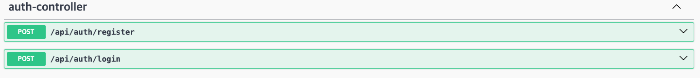
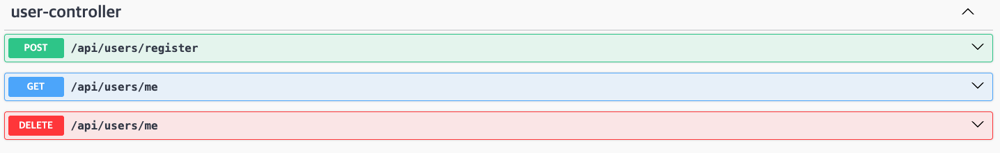
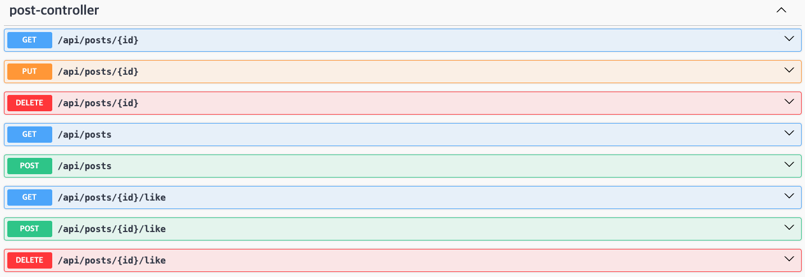
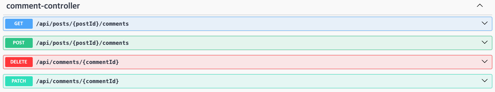
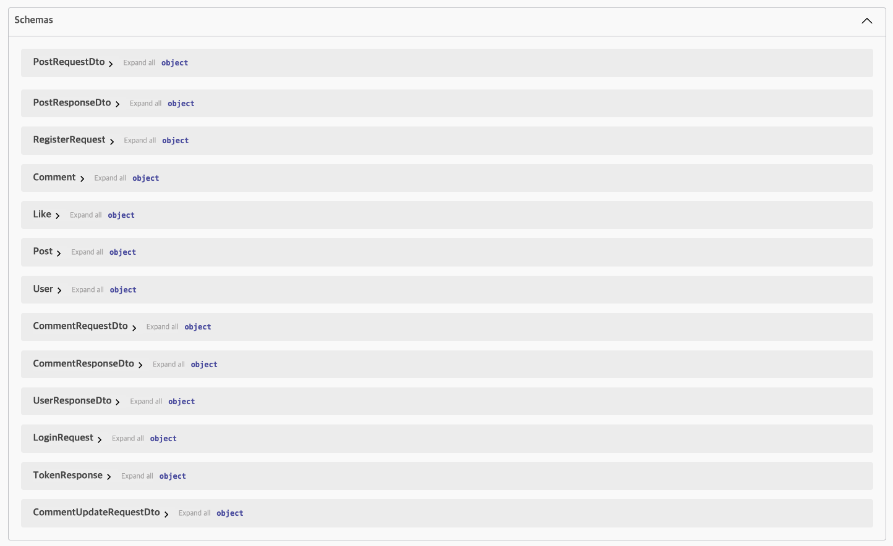
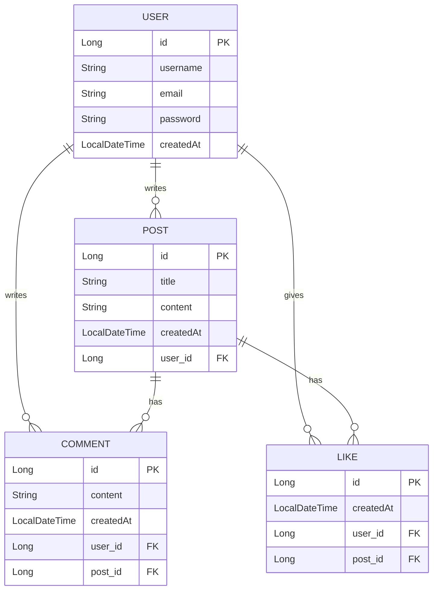

# 📌 게시판 REST API 프로젝트

## 📖 프로젝트 개요

Spring Boot 기반의 **게시판 REST API 서비스**입니다.  
회원 관리, 게시글 CRUD, 댓글, 좋아요 기능을 포함하며, **JWT 인증/인가**를 적용하여 보안성을 강화했습니다.  
API는 RESTful 규칙에 따라 설계하였으며 Postman을 통한 테스트를 거쳤습니다.

---

## ⚙️ 기술 스택

- **Backend**: Java 17, Spring Boot 3.x, Spring Security, Spring Data JPA, JWT
- **Database**: MySQL
- **ORM**: Hibernate
- **Build Tool**: Gradle
- **Test**: JUnit5, Postman
- **Tooling**: IntelliJ IDEA, GitHub

---

## 🛠 주요 기능

### 1. 회원(User)

- 회원가입, 로그인(JWT 발급)
- 내 정보 조회
- 회원 탈퇴
- 비밀번호 암호화(BCrypt)

### 2. 게시글(Post)

- 게시글 작성 / 조회(전체, 단건) / 수정 / 삭제
- 작성자만 수정·삭제 가능 (권한 체크)

### 3. 댓글(Comment)

- 게시글별 댓글 작성 / 조회 / 수정 / 삭제
- 작성자 인증 및 권한 검증

### 4. 좋아요(Like)

- 게시글 좋아요 토글 (좋아요 / 취소)
- 게시글별 좋아요 개수 조회

### 5. 인증/인가

- JWT 토큰 기반 인증
- Spring Security와 연동하여 Controller에서 `@AuthenticationPrincipal`로 사용자 정보 활용

---

## 📑 API 명세서

### 1. 회원(User)

| 기능 | Method | URL | Request Body | Response | 인증 |
| --- | --- | --- | --- | --- | --- |
| 회원가입 | POST | /api/users/signup | `{ "username": "test", "password": "1234", "email": "test@test.com" }` | 201 Created + User 정보 | ❌ |
| 로그인 | POST | /api/users/login | `{ "username": "test", "password": "1234" }` | 200 OK + `{ "token": "JWT" }` | ❌ |
| 내 정보 조회 | GET | /api/users/me | 없음 | 200 OK + User 정보 | ✅ |
| 회원 탈퇴 | DELETE | /api/users/me | 없음 | 204 No Content | ✅ |

---

### 2. 게시글(Post)

| 기능 | Method | URL | Request Body | Response | 인증 |
| --- | --- | --- | --- | --- | --- |
| 게시글 작성 | POST | /api/posts | `{ "title": "제목", "content": "내용" }` | 201 Created + Post 정보 | ✅ |
| 게시글 목록 조회 | GET | /api/posts | 없음 | 200 OK + `[ {id, title, content, author, createdAt} ]` | ❌ |
| 게시글 상세 조회 | GET | /api/posts/{postId} | 없음 | 200 OK + Post 정보 | ❌ |
| 게시글 수정 | PUT | /api/posts/{postId} | `{ "title": "수정 제목", "content": "수정 내용" }` | 200 OK + Post 정보 | ✅ |
| 게시글 삭제 | DELETE | /api/posts/{postId} | 없음 | 204 No Content | ✅ |

---

### 3. 댓글(Comment)

| 기능 | Method | URL | Request Body | Response | 인증 |
| --- | --- | --- | --- | --- | --- |
| 댓글 작성 | POST | /api/posts/{postId}/comments | `{ "content": "댓글 내용" }` | 201 Created + Comment 정보 | ✅ |
| 댓글 목록 조회 | GET | /api/posts/{postId}/comments | 없음 | 200 OK + `[ {id, content, author, createdAt} ]` | ❌ |
| 댓글 수정 | PUT | /api/comments/{commentId} | `{ "content": "수정 댓글" }` | 200 OK + Comment 정보 | ✅ |
| 댓글 삭제 | DELETE | /api/comments/{commentId} | 없음 | 204 No Content | ✅ |

---

### 4. 좋아요(Like)

| 기능 | Method | URL | Request Body | Response | 인증 |
| --- | --- | --- | --- | --- | --- |
| 좋아요 추가/취소 (토글) | POST | /api/posts/{postId}/likes | 없음 | 200 OK + `{ "liked": true/false, "likeCount": 5 }` | ✅ |
| 좋아요 개수 조회 | GET | /api/posts/{postId}/likes/count | 없음 | 200 OK + `{ "likeCount": 5 }` | ❌ |
> API 설계는 RESTful 규칙에 맞게 작성되었으며, Swagger 적용을 통해 문서화할 수 있습니다.


---
## 📜 Swagger API 문서

Swagger UI를 통해 프로젝트의 모든 API를 확인할 수 있습니다.  
인증, 회원, 게시글, 댓글/좋아요, 요청/응답 모델(Schema)까지 한눈에 볼 수 있습니다.

### 1. Auth

- 로그인(JWT 발급), 회원가입 등 인증 관련 API

### 2. User

- 회원 조회, 회원 탈퇴 등 User 관련 API

### 3. Post

- 게시글 작성, 조회, 수정, 삭제 등 Post 관련 API

### 4. Comment

- 댓글 작성/조회/수정/삭제 및 게시글 좋아요 토글

### 5. Schema

- 요청(Request)과 응답(Response) 모델 구조 확인
---

## 🧪 Swagger 활용

- **API 테스트**: Swagger UI를 통해 각 API 엔드포인트에 대해 요청/응답을 직접 확인 가능  
- **JWT 인증 연동**: 로그인 후 발급받은 토큰을 Swagger Authorize 기능을 통해 Header에 자동 삽입  
- **문서화 장점**: 협업 시 직관적 API 확인 및 프론트엔드 개발자와의 소통 원활
---

## 🗄 ERD(Entity Relationship Diagram)



---

## 🧪 테스트

- **Postman**: 회원가입 → 로그인(JWT 발급) → 게시글 작성 → 댓글 → 좋아요 → 삭제 플로우 테스트 완료
- **JUnit**: UserService, PostService, CommentService 단위 테스트 작성

---

## 📂 프로젝트 구조

```
src/main/java/com/example/demo
 ├── controller       # REST API Controller
 ├── domain           # JPA Entity
 ├── dto              # DTO 클래스
 ├── repository       # JPA Repository
 ├── security         # JWT, Security 설정
 └── service          # 비즈니스 로직
```

---

## 🚀 구현 순서 (프로젝트 학습 로드맵)

1. **환경 세팅**: Spring Boot + MySQL 연결
2. **Entity 설계**: User, Post, Comment, Like
3. **CRUD 구현**: 회원, 게시글, 댓글 API
4. **보안 적용**: Spring Security + JWT 인증/인가
5. **비즈니스 로직 고도화**: 작성자 권한 검증, 좋아요 토글
6. **테스트 및 문서화**: Postman / API 명세서 / ERD 작성
7. **최종 정리**: README 작성 (포트폴리오 완성)

---

## ✅ 프로젝트를 통해 배운 점

- RESTful API 설계 원칙과 JWT 기반 인증/인가 흐름 이해
- Spring Security 필터 체인과 `@AuthenticationPrincipal` 활용
- JPA 연관관계 매핑(1:N, N:M 유사 구조)과 데이터 무결성 유지
- 테스트(Postman)를 통한 API 검증 습관화
- 협업 시 API 문서화(Swagger, README, ERD)의 중요성 체감
